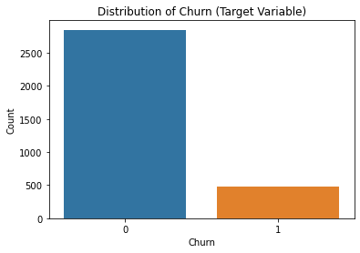
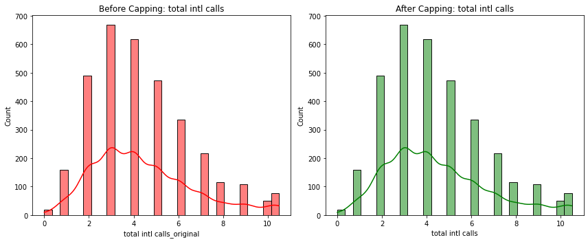
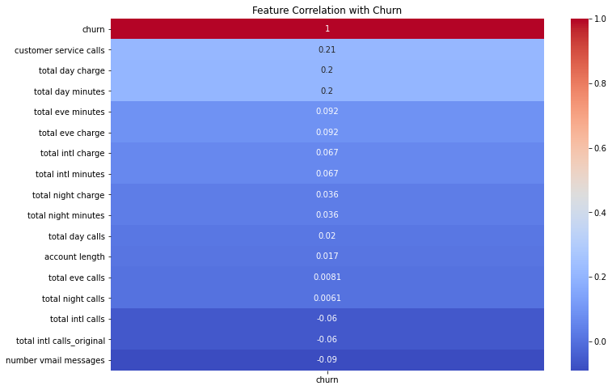
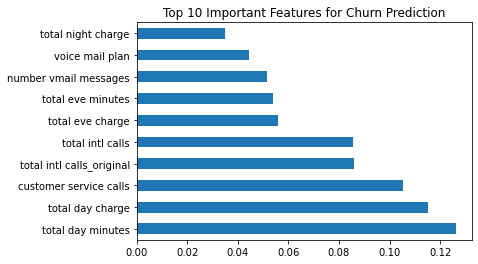

# SYRIATEL CUSTOMER CHURN
Author: Danton Kipngeno

## Overview
This project aims to develop a machine learning model that predicts customer churn for SyriaTel, a telecommunications company. Churn refers to customers who stop using the company's services. By identifying at-risk customers early, the company can take proactive steps to retain them, thereby reducing revenue loss and improving customer satisfaction.

## Business and Data Understanding

### Business Problem

SyriaTel faces rising customer churn, which can impact long-term profitability. Understanding the drivers behind churn and identifying churn-prone customers allows SyriaTel to implement targeted retention strategies.

### Key Business Questions
- What customer attributes are most predictive of churn?

- Are there usage behaviors that indicate higher churn risk?

- Can we build a model that accurately identifies customers who are likely to churn?

- How can SyriaTel use this model to intervene and retain at-risk customers?

### Data understanding

The dataset, sourced from Kaggle, comprises 20 variables capturing customer behaviors and service usage patterns, including a total of 3,333 records. Within this dataset, 483 entries represent churned customers, while the remaining 2,850 correspond to retained customers.

The dataset exhibits class imbalance, with 85.51% of customers labeled as "retained" and 14.49% as "churned."

The dataframe has both continuous and categorical variables.

### Data Preprocessing and Outlier Handling
- **Missing Values**: The dataset had no missing values, so imputation was not necessary.
- **Categorical Encoding**: Binary categorical features (e.g., international plan, voicemail plan) were encoded as 0/1.
- **Class Imbalance**: Addressed using **SMOTE** to oversample the minority class (churners).
- **Outlier Detection and Treatment**:
  - Outliers were identified using **Interquartile range(IQR) analysis**.
  - Outliers were also **capped** to ensure data was ready to be used in modelling.

## Modelling

### Models Used
- **Logistic Regression** (baseline)
- **Decision Tree Classifier** (tuned)

### Feature Selection
- Exploration revealed several features were highly correlated, especially usage and charge-related variables.

- Based on domain knowledge and correlation analysis, some redundant features were dropped 

### Model Training
- Trained baseline models using Logistic Regression and Decision Tree Classifier.
- Applied **SMOTE** to address class imbalance.
- Performed **hyperparameter tuning** using GridSearchCV with cross-validation for Decision Tree.

## Evaluation
Decision Tree Classifier Performance on Test Set:
- Accuracy: 88%

- Recall (Churners): 72%

- AUC Score: 0.83

Classification Report Summary:

- Class 0 (Non-Churn): Precision 0.95, Recall 0.90

- Class 1 (Churn): Precision 0.56, Recall 0.72

Confusion Matrix and ROC AUC curves were used to further assess performance.

The decision tree model with fine-tuned hyperparameters exhibits superior performance, boasting the highest recall score, with accuracy and precision scores surpassing the mean values.

## Conclusions
A tuned Decision Tree model outperformed Logistic Regression, capturing complex churn patterns.

High recall for churners (72%) means the model is effective at catching customers at risk of leaving.

Key churn predictors include:

- Total day minutes and charges

- International plan subscription

- Number of customer service calls

**Business Implications**
- Frequent day-time callers and international plan users are more likely to churn.

- Poor customer service experiences may drive churn.

- Voicemail plans and night-time usage are associated with lower churn risk.

## Recommendation

1. Operational Integration: Deploy the model in SyriaTel’s operational systems to flag high-risk customers monthly or weekly.

2. Customer Support Focus: Train support teams to handle frequent callers with care, as they are more likely to churn.

3. Marketing Targeting: Direct retention incentives toward customers with high day-time usage or those on international plans.

4. Continuous Monitoring: Regularly retrain the model with updated data to maintain performance as customer behavior evolves.
